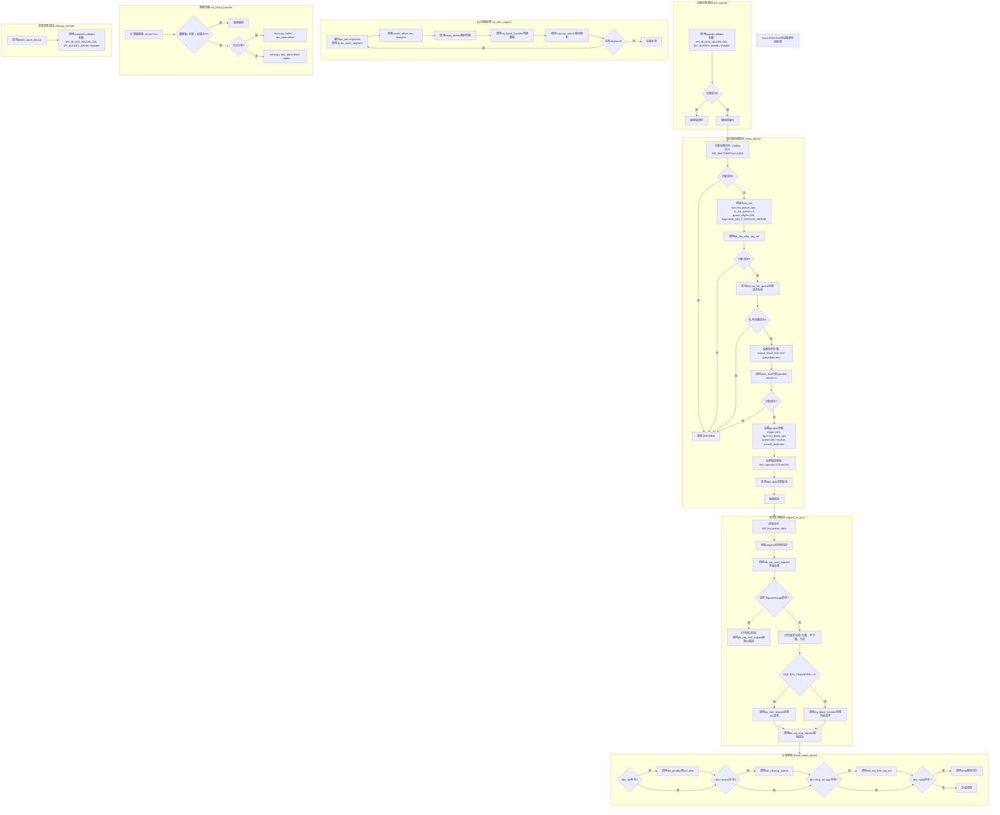

> 111

测试思维导图导出的svg图片是否能正常显示

```mermaid
flowchart TD
    A[Linux RAM Disk块设备驱动流程图]
subgraph A1 [设备注册模块 init_module]
    B1[调用register_blkdev<br>参数: MY_BLOCK_MAJOR=240, MY_BLKDEV_NAME='mybdev']
    B2{注册成功?}
    B3[返回错误码]
    B4[继续初始化]
    
    B1 --> B2
    B2 -- 是 --> B4
    B2 -- 否 --> B3
end

subgraph A2 [块设备创建模块 setup_device]
    C1[分配设备内存: vmalloc<br>大小: NR_SECTORS*512=64KB]
    C2{分配成功?}
    C3[返回-ENOMEM]
    C4[初始化tag_set<br>ops=my_queue_ops, nr_hw_queues=1<br>queue_depth=128, flags=BLK_MQ_F_SHOULD_MERGE]
    C5[调用blk_mq_alloc_tag_set]
    C6{分配成功?}
    C7[调用blk_mq_init_queue创建请求队列]
    C8{队列创建成功?}
    C9[设置队列参数: logical_block_size=512<br>queuedata=dev]
    C10[调用alloc_disk分配gendisk<br> minors=1]
    C11{分配成功?}
    C12[设置gendisk参数: major=240, fops=my_block_ops<br>queue=dev->queue, private_data=dev]
    C13[设置磁盘容量: set_capacity=128 sectors]
    C14[调用add_disk注册磁盘]
    C15[返回成功]
    
    C1 --> C2
    C2 -- 是 --> C4
    C2 -- 否 --> C3
    C4 --> C5 --> C6
    C6 -- 是 --> C7 --> C8
    C6 -- 否 --> C3
    C8 -- 是 --> C9 --> C10 --> C11
    C8 -- 否 --> C3
    C11 -- 是 --> C12 --> C13 --> C14 --> C15
    C11 -- 否 --> C3
end

subgraph A3 [请求处理模块 request_fn_proc]
    D1[接收请求: blk_mq_queue_data]
    D2[获取request结构体指针]
    D3[调用blk_mq_start_request开始处理]
    D4{是否为passthrough请求?}
    D5[打印跳过信息<br>调用blk_mq_end_request返回IO错误]
    D6[打印请求信息: 位置、字节数、方向]
    D7{USE_BIO_TRANSFER==1?}
    D8[调用my_xfer_request处理bio请求]
    D9[调用my_block_transfer处理传统请求]
    D10[调用blk_mq_end_request返回成功]
    
    D1 --> D2 --> D3 --> D4
    D4 -- 是 --> D5
    D4 -- 否 --> D6 --> D7
    D7 -- 是 --> D8 --> D10
    D7 -- 否 --> D9 --> D10
end

subgraph A4 [bio传输处理 my_xfer_request]
    E1[遍历bio_vec segments<br>使用rq_for_each_segment]
    E2[获取sector, offset, len, direction]
    E3[调用kmap_atomic映射页面]
    E4[调用my_block_transfer传输数据]
    E5[调用kunmap_atomic取消映射]
    E6{还有segment?}
    E7[完成处理]
    
    E1 --> E2 --> E3 --> E4 --> E5 --> E6
    E6 -- 是 --> E1
    E6 -- 否 --> E7
end

subgraph A5 [数据传输 my_block_transfer]
    F1[计算偏移量: sector*512]
    F2{偏移量+长度 > 设备大小?}
    F3[直接返回]
    F4{方向为写?}
    F5[memcpy: buffer → dev_data+offset]
    F6[memcpy: dev_data+offset → buffer]
    
    F1 --> F2
    F2 -- 是 --> F3
    F2 -- 否 --> F4
    F4 -- 是 --> F5
    F4 -- 否 --> F6
end

subgraph A6 [资源清理模块 cleanup_module]
    G1[调用delete_block_device]
    G2[调用unregister_blkdev<br>参数: MY_BLOCK_MAJOR=240, MY_BLKDEV_NAME='mybdev']
    
    G1 --> G2
end

subgraph A7 [设备删除 delete_block_device]
    H1{dev->gd存在?}
    H2[调用del_gendisk和put_disk]
    H3{dev->queue存在?}
    H4[调用blk_cleanup_queue]
    H5{dev->tag_set.tags存在?}
    H6[调用blk_mq_free_tag_set]
    H7{dev->data存在?}
    H8[调用vfree释放内存]
    
    H1 -- 是 --> H2 --> H3
    H1 -- 否 --> H3
    H3 -- 是 --> H4 --> H5
    H3 -- 否 --> H5
    H5 -- 是 --> H6 --> H7
    H5 -- 否 --> H7
    H7 -- 是 --> H8
    H7 -- 否 --> H9[完成清理]
end

B4 --> C1
C15 --> A3
D10 --> A7
```
